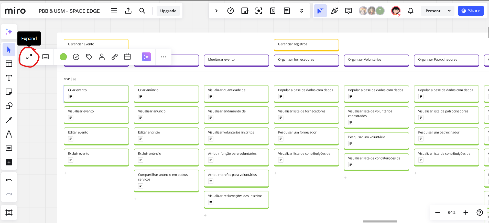

## 1. Introdução
Este documento demonstra as atividades utilizando o PBB (Product Backlog Building) no estudo de caso "HealthNet" e a USM (User Story Mapping) apresentado no estudo de caso "ComunEventos". 

## 2. PBB

### Contexto
A "HealthNet" enfrenta um desafio significativo devido à falta de uma estrutura unificada para a gestão de dados de pacientes em suas diversas unidades espalhadas por vários estados. Os profissionais de saúde lidam com sistemas desatualizados e incompatíveis, resultando em prontuários isolados que não se comunicam entre si. Isso atrasa os processos, aumenta o risco de erros médicos e dificulta o acesso a informações completas e atualizadas. Além disso, os sistemas de agendamento de consultas são ineficientes, causando longos tempos de espera e frustração. O controle de medicamentos também é prejudicado, dificultando o rastreamento de prescrições e aumentando o risco de complicações médicas. A dependência de processos manuais e papelada agrava ainda mais a situação, tornando as operações lentas, propensas a erros, e complicando a conformidade com regulamentações de proteção de dados de saúde.

### Miro
Abaixo se encontra o miro da equipe e que pode ser visualizado clicando [aqui](https://miro.com/app/board/uXjVKh5ybsk=/?share_link_id=77089072024)

<iframe width="768" height="432" src="https://miro.com/app/live-embed/uXjVKh5ybsk=/?moveToViewport=-10960,-2442,18545,20911&embedId=672700226937" frameborder="0" scrolling="no" allow="fullscreen; clipboard-read; clipboard-write" allowfullscreen></iframe>

A atividade do PBB foi realizada primeiro utilizando a criação do PBB canvas, obtendo os PBIs (sendo prorizados utilizando um framework chamado COORG) e com isso gerando o BDD.

## 3. USM

### Contexto
A ComunEventos é uma startup criada por três jovens empreendedores que, após participar de eventos comunitários, identificaram a necessidade de otimizar a experiência para organizadores e participantes. A missão da empresa é desenvolver uma plataforma online que facilite a organização e promoção desses eventos, promovendo um ecossistema digital para que a comunidade se conecte e participe de atividades que reflitam seus valores. Eventos comunitários, como feiras, workshops e atividades culturais, são importantes para fortalecer laços sociais e promover a coesão na comunidade, permitindo que as pessoas se conectem, aprendam e trabalhem juntas para melhorar seu ambiente.

A plataforma irá permitir que Organizadores de Eventos consigam contatar Patrocinadores e Voluntários para organizar os eventos e também promovê-los por meio da plataforma, para que os Participantes interessados consigam ver os detalhes dos eventos, comprar ingressos e ir aos eventos.

### Miro

Abaixo se encontra o miro da equipe e que pode ser visualizado clicando [aqui](https://miro.com/app/board/uXjVKh5ybsk=/?share_link_id=77089072024)

<iframe width="768" height="432" src="https://miro.com/app/live-embed/uXjVKh5ybsk=/?moveToViewport=12843,-410,11012,2448&embedId=217166548693" frameborder="0" scrolling="no" allow="fullscreen; clipboard-read; clipboard-write" allowfullscreen></iframe>

Foram produzidas 117 Histórias de Usuários. Para verificar as Histórias de Usuário é necessário expandir os os cards de título de história de usuário no Miro , conforme mostra a imagem abaixo :

## Historico de revisão

|    Data    | Versão |        Alteração         |                    Autor                    |
| :--------: | :----: | :----------------------: | :-----------------------------------------: |
| 10/09/2024 | `0.1`  |   Criação do documento   | [Pedro Lucas](https://github.com/lucasdray) |

