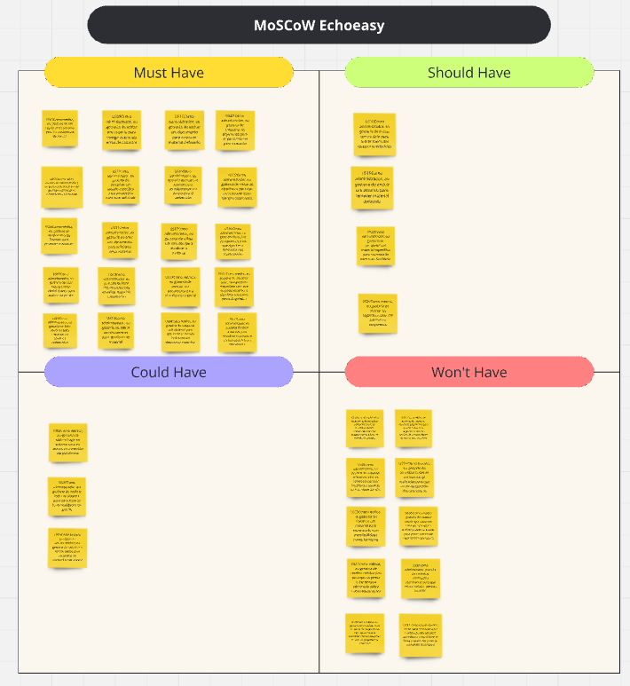
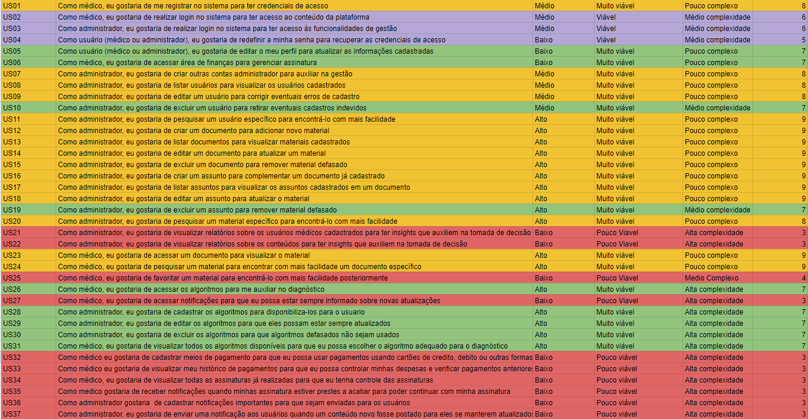

# MVP

## 1. Introdução

Este documento descreve o processo de priorização e definição do MVP, mostrando a metodologia utilizada e mostrando a lista de funcionalidades escolhidas para compor o MVP

## 2. Priorização
Utilizamos o sistema de pontos para avaliar a complexidade, a viabilidade e o valor de negócio de cada tarefa do backlog. Além disso, adotamos o método MoSCoW para classificar as tarefas em essenciais (Must have), importantes (Should have), desejáveis (Could have) e não essenciais para este ciclo (Won’t have). Essa combinação nos permitiu priorizar eficientemente o trabalho, garantindo foco nas entregas críticas.

## MosCow

## Tabala de Pontos

## Miro Contendo a Priorização (Tabela de Pontos e MosCow)
Abaixo se encontra o miro que pode ser visualizado clicando [aqui](https://miro.com/welcomeonboard/eW9PVXJFcVAwNlJDdUhwTUd4b2ZuNVk0QkxGNzFFaXFYSVZLMFhLeWxUQkNIMUF5ekttUFc1eEVkNWozZnZDZHwzMDc0NDU3MzYyOTQyNDYzNTMxfDI=?share_link_id=810399639819)

<iframe width="768" height="432" src="https://miro.com/welcomeonboard/eW9PVXJFcVAwNlJDdUhwTUd4b2ZuNVk0QkxGNzFFaXFYSVZLMFhLeWxUQkNIMUF5ekttUFc1eEVkNWozZnZDZHwzMDc0NDU3MzYyOTQyNDYzNTMxfDI=?share_link_id=298669973303" frameborder="0" scrolling="no" allow="fullscreen; clipboard-read; clipboard-write" allowfullscreen></iframe>

### Criterios utilizados para definir a priorização:
    - Nota >= 8 (Must Have)
    - Nota = 7  (Should Have)
    - Nota >= 5 e Nota <= 6 (Could Have) 
    - Nota < 5 (Won't Have)

## 3. MVP

O MVP foi cuidadosamente planejado para incluir as funcionalidades essenciais que proporcionam valor imediato aos usuários. As funcionalidades selecionadas para o MVP foram priorizadas com base na metodologia USM, focando naquelas que oferecem o maior impacto e utilidade para médicos e administradores. O objetivo do MVP é validar a viabilidade do produto, coletar feedback dos usuários e orientar o desenvolvimento contínuo com base nas necessidades reais e experiências práticas. Abaixo, na tabela 01, estão listadas as funcionalidades incluídas no MVP, juntamente com seus respectivos critérios de aceitação.

**Tabela 01** - Listagem do MVP

| Tema | Epico                                | Capacidades                      | Features                                              | User Story | Descrição                                                                                                                                           |
|------|--------------------------------------|:---------------------------------|-------------------------------------------------------|------------|-----------------------------------------------------------------------------------------------------------------------------------------------------|
| TM01 | EP01 Gestão de Conteúdos e Usuários  | C01 Gerenciamento de Usuários    | F01 Registro de Médicos e Administradores             | US01       | Como médico, eu gostaria de me registrar no sistema para ter credenciais de acesso                                                                  |
| TM01 | EP01 Gestão de Conteúdos e Usuários  | C01  Gerenciamento de Usuários   | F05 Login de Médicos e Administradores                | US02       | Como médico, eu gostaria de realizar login no sistema para ter acesso ao conteúdo da plataforma                                                     |
| TM01 | EP01 Gestão de Conteúdos e Usuários  | C01 Gerenciamento de Usuários    | F05 Login de Médicos e Administradores                | US03       | Como administrador, eu gostaria de realizar login no sistema para ter acesso às funcionalidades de gestão                                           |
| TM01 | EP01 Gestão de Conteúdos e Usuários  | C01  Gerenciamento de Usuários   | F04  Edição de Perfil de Usuário                      | US04       | Como usuário (médico ou administrador), eu gostaria de redefinir a minha senha para recuperar as credenciais de acesso                              |
| TM01 | EP01  Gestão de Conteúdos e Usuários | C01  Gerenciamento de Usuários   | F04 Edição de Perfil de Usuário                       | US05       | Como usuário (médico ou administrador), eu gostaria de editar o meu perfil para atualizar as informações cadastradas                                |
| TM01 | EP02 Assinatura e Notificações       | C04  Gerenciamento de Finanças   | F12 Gerenciamento de Assinatura                       | US06       | Como médico, eu gostaria de acessar área de finanças para gerenciar assinatura                                                                      |
| TM01 | EP01 Gestão de Conteúdos e Usuários  | C01   Gerenciamento de Usuários  | F01 Registro de Médicos e Administradores             | US07       | Como administrador, eu gostaria de criar outras contas administrador para auxiliar na gestão                                                        |
| TM01 | EP01 Gestão de Conteúdos e Usuários  | C01   Gerenciamento de Usuários  | F02   Pesquisa e Listagem de Usuários                 | US08       | Como administrador, eu gostaria de listar usuários para visualizar os usuários cadastrados                                                          |
| TM01 | EP01 Gestão de Conteúdos e Usuários  | C01   Gerenciamento de Usuários  | F03  Edição e Exclusão de Usuários                    | US09       | Como administrador, eu gostaria de editar um usuário para corrigir eventuais erros de cadastro                                                      |
| TM01 | EP01 Gestão de Conteúdos e Usuários  | C01   Gerenciamento de Usuários  | F03   Edição e Exclusão de Usuários                   | US10       | Como administrador, eu gostaria de excluir um usuário para retirar eventuais cadastros indevidos                                                    |
| TM01 | EP01 Gestão de Conteúdos e Usuários  | C01   Gerenciamento de Usuários  | F02  Pesquisa e Listagem de Usuários                  | US11       | Como administrador, eu gostaria de pesquisar um usuário específico para encontrá-lo com mais facilidade                                             |
| TM01 | EP01 Gestão de Conteúdos e Usuários  | C02  Gerenciamento de conteúdos  | F06  Criação e Listagem de Documentos                 | US12       | Como administrador, eu gostaria de criar um documento para adicionar novo material                                                                  |
| TM01 | EP01 Gestão de Conteúdos e Usuários  | C02  Gerenciamento de conteúdos  | F06  Criação e Listagem de Documentos                 | US13       | Como administrador, eu gostaria de listar documentos para visualizar materiais cadastrados                                                          |
| TM01 | EP01 Gestão de Conteúdos e Usuários  | C02  Gerenciamento de conteúdos  | F07  Edição e Exclusão de Documentos                  | US14       | Como administrador, eu gostaria de editar um documento para atualizar um material                                                                   |
| TM01 | EP01 Gestão de Conteúdos e Usuários  | C02  Gerenciamento de conteúdos  | F07  Edição e Exclusão de Documentos                  | US15       | Como administrador, eu gostaria de excluir um documento para remover material defasado                                                              |
| TM01 | EP01 Gestão de Conteúdos e Usuários  | C02  Gerenciamento de conteúdos  | F06  Criação e Listagem de Documentos                 | US16       | Como administrador, eu gostaria de criar um assunto para complementar um documento já cadastrado                                                    |
| TM01 | EP01 Gestão de Conteúdos e Usuários  | C02  Gerenciamento de conteúdos  | F06  Criação e Listagem de Documentos                 | US17       | Como administrador, eu gostaria de listar assuntos para visualizar os assuntos cadastrados em um documento                                          |
| TM01 | EP01 Gestão de Conteúdos e Usuários  | C02   Gerenciamento de conteúdos | F07 Edição e Exclusão de Documentos                   | US18       | Como administrador, eu gostaria de editar um assunto para atualizar o material                                                                      |
| TM01 | EP01 Gestão de Conteúdos e Usuários  | C02   Gerenciamento de conteúdos | F07  Edição e Exclusão de Documentos                  | US19       | Como administrador, eu gostaria de excluir um assunto para remover material defasado                                                                |
| TM01 | EP01 Gestão de Conteúdos e Usuários  | C02   Gerenciamento de conteúdos | F08   Pesquisa de Conteúdo e Visualização de Material | US20       | Como administrador, eu gostaria de pesquisar um material específico para encontrá-lo com mais facilidade                                            |
| TM01 | EP01 Gestão de Conteúdos e Usuários  | C02  Gerenciamento de conteúdos  | F08   Pesquisa de Conteúdo e Visualização de Material | US23       | Como médico, eu gostaria de acessar um documento para visualizar o material                                                                         |
| TM01 | EP01 Gestão de Conteúdos e Usuários  | C02  Gerenciamento de conteúdos  | F08  Pesquisa de Conteúdo e Visualização de Materia   | US24       | Como médico, eu gostaria de pesquisar um material para encontrar com mais facilidade um documento específico                                        |
| TM01 | EP01  Gestão de Conteúdos e Usuários | C03  a Algoritmos de Diagnóstico | F11  Acesso ao Algoritimo                             | US26       | Como médico, eu gostaria de acessar os algoritmos para me auxiliar no diagnóstico                                                                   |
| TM01 | EP01 Gestão de Conteúdos e Usuários  | C01 Gerenciamento de Usuários    | F10 Gestão de Algoritmos                              | US28       | Como administrador, eu gostaria de cadastrar os algoritmos para disponibiliza-los para o usuario                                                    |
| TM01 | EP01 Gestão de Conteúdos e Usuários  | C01  Gerenciamento de Usuários   | F10 Gestão de Algoritmos                              | US29       | Como administrador, eu gostaria de editar os algoritmos para que eles possam estar sempre atualizados                                               |
| TM01 | EP01 Gestão de Conteúdos e Usuários  | C01  Gerenciamento de Usuários   | F10 Gestão de Algoritmos                              | US30       | Como administrador, eu gostaria de excluir os algoritmos para que algoritmos defasados não sejam usados                                             |
| TM01 | EP01 Gestão de Conteúdos e Usuários  | C03  a Algoritmos de Diagnóstico | F11  Acesso ao Algoritimo                             | US31       | Como médico, eu gostaria de visualizar todos os algoritmos disponíveis para que eu possa escolher o algoritmo adequado para o diagnóstico           |

## 4. Histórico de Versões

| Data       | Versão | Descrição                                           | Autor(es)                                                                                                                                                                                     |
|:-----------|:------:|:----------------------------------------------------| :-------------------------------------------------------------------------------------------------------------------------------------------------------------------------------------------- |
| 31/07/2024 | `0.1`  | Criação e Estruturação do documento                 | [Leandro Almeida](https://github.com/leanars)                                                                                                                                                 |
| 31/07/2024 | `0.2`  | Adição dos tópicos USM e MVP                        | [Alexandre Beck](https://github.com/zzzBECK), [Leandro Almeida](https://github.com/leanars), [Lucas Antunes](https://github.com/LucasGSAntunes) e [Pedro Lucas](https://github.com/lucasdray) |
| 02/09/2024 | `0.3`  | Adicionando MosCow e Tabela de Priorição por pontos | [Tales Rodrigues](https://github.com/TalesRG)|
| 08/09/2024 | `0.4`  | Corrigindo MVP para seguir a estrutura do SAFe      | [Tales Rodrigues](https://github.com/TalesRG)|