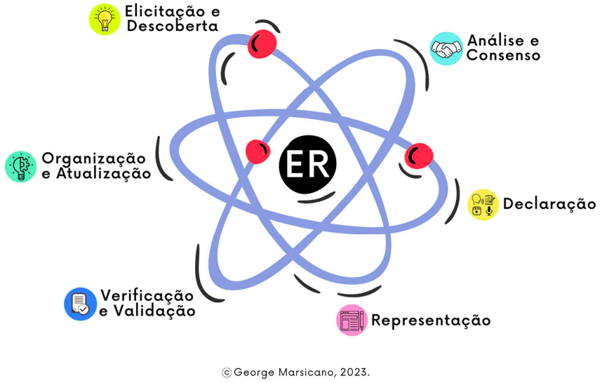

# PROCESSO DE DESENVOLVIMENTO DE SOFTWARE

## 1. Metodologia

Após análise em equipe, guiados pelo Framework de Gupta, escolhemos:

- **Abordagem de desenvolvimento**: Ágil
- **Ciclo de Vida**: Ágil
- **Processo**: XP adaptado

Apesar do XP ser o processo mais pontuado pelo framework, optamos por utilizar o XP de forma adaptada, já que não seguiremos todos os seus rituais. Por exemplo, a priorização foi feita utilizando MOSCOW ao invés de planning poker, utilização apenas de testes de sistema, e a validação do sistema está sendo feita por meio de feedback direto do cliente.

    

## 2. Planejamento de requisitos
Fase focada em encontrar, extrair, obter ou provocar uma resposta, reação, informação dos usuários para construção dos requisitos, analisar os requisitos brutos e conciliar os interesses dos stakeholders, além de comunicar os requisitos para os interessados em diferentes níveis de glanularidade e dividindo entre funcionais e não funcionais. (MARSICANO, 2023).

|     Nome da Atividade     |                              Método                              |      Ferramenta       |                      Entrega                      |
|:-------------------------:|:----------------------------------------------------------------:|:---------------------:|:-------------------------------------------------:|
|  Elicitação e Descoberta  |             Entrevista com o cliente e Brainstorming             | Microsoft Teams, Miro |                Lista de RFs e RNFs                |
|    Análise e consenso     |                              MosCoW                              |  Miro, Google Sheets  |                   User Stories                    |
|        Declaração         |                      Critérios de aceitação                      |       GitPages        | Temas, Épicos, Capacitade, Feature e User Stories |
|       Representação       |                           Prototipagem                           |         Figma         |           Protótipo de média fidelidade           |
|  Verificação e Validação  | DoR e DoD; Checklist; Feedback do cliente; Reunião com o cliente | Miro, Microsoft Teams |              Definição de DoR e DoD               |
| Organização e Atualização |                           Backlog SAFe                           |       Gitpages        |                      Backlog                      |

    

## 3. Processo de ER

O processo de Engenharia de Requisitos, definido com auxílio do algoritmo de escolha apresentado pelo Handbook [#4](./referencias.md#1-referência-bibliográficas), segue como base o mesmo contexto apresentado anteriormente. Como características principais a se destacar estão o alvo que é um cliente específico, propósito exploratório de requisitos e tempo seccionado em iterações com tempo definido, o participativo é o que melhor se encaixa as nuances do projeto prosposto.

    

## 5. Histórico de revisão

|    Data    | Versão |                 Alteração                  |                                       Autor                                        |
|:----------:|:------:|:------------------------------------------:|:----------------------------------------------------------------------------------:|
| 16/04/2024 | `0.1`  |            Criação do documento            |                      [Alexandre](https://github.com/zzzBECK)                       |
| 09/09/2024 | `0.2`  |          Alteração das atividades          | [Leandro](https://github.com/LeanArs), [Pedro Lucas](https://github.com/lucasdray) |
| 09/09/2024 | `0.3`  | Readequação do processo de desenvolvimento |                       [Leandro](https://github.com/LeanArs)                        |
