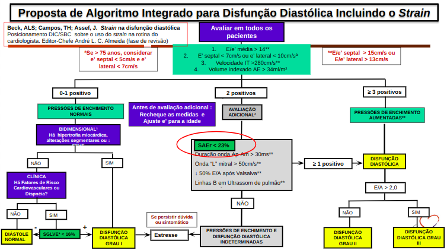

# Representação

## 1. Introdução
A representação é a atividade da Engenharia de Requisitos que envolve a apresentação dos requisitos em modelos e/ou visualizações do produtos. A representação de requisitos pode ser classificada em:

– Informal: representações informais ainda que possam seguir algum padrão visual; 
– Semiformal: representações que seguem uma notação ou linguagem específicas;
– Formal: representações baseadas em uma sintaxe e semântica matemática.

## 2. Representação Informal
Sob esse contexto abaixo encontra-se um protótipo de média fidelidade classificado como uma uma representação informal.

<iframe style="border: 1px solid rgba(0, 0, 0, 0.1);" width="100%" height="500" src="https://www.figma.com/embed?embed_host=share&url=https%3A%2F%2Fwww.figma.com%2Fdesign%2F5LRdAdojuRQG7c2VBjKxKj%2FEchoeasy%3Fnode-id%3D44-2167%26t%3DCYmNKt87H4WhmhjT-1" allowfullscreen></iframe>

## 3. Representação Formal

## Histórico de versão

|    Data    | Versão |      Alteração       |                                           Autor                                            |
|:----------:|:------:|:--------------------:|:------------------------------------------------------------------------------------------:|
| 10/09/2024 | `0.1`  | Criação do documento | [Leandro Almeida](https://github.com/leanars), [Pedro Lucas](https://github.com/lucasdray) |